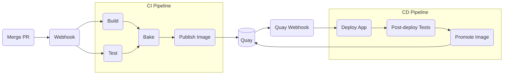

# Greeting Application CI/CD

This repository contains CI/CD implementation for the greeting application. ([greeting-ui](https://github.com/tom-stockwell/greeting-ui) & [greeting-api](https://github.com/tom-stockwell/greeting-api)).

The CI & CD pipelines are implemented using [tekton](https://tekton.dev) pipelines, while [kustomize](https://kustomize.io) is used to configure the Kubernetes resources.

## Prerequisites

- Access to an OpenShift cluster
- Tekton installed on cluster (preferably using the OpenShift Pipelines operator)
- `oc` CLI client

Additionally, you must have at least `edit` permissions on the following pre-provisioned namespaces:

- example-app-cicd

## Installation

The CI/CD pipelines can be installed manually using the below commands.
Preferably, however, a GitOps solution should be used in order to sync this repository automatically with the cluster

```shell
oc apply -k .
```

If using an older version of the kubectl or OpenShift client that does not support  kustomize, you can achieve the same effect with the following:

```shell
kustomize build . | oc apply -f -
```

**Note:** If using standard Kubernetes replace `oc` with `kubectl` in the above commands.

## Components

- [`Pipelines`](./pipelines): contains pipelines
- [`Tasks`](./tasks): contains tasks & cluster tasks
- [`Triggers`](./triggers): contains various resources related to Tekton Triggers 
- [`Scripts`](./bin): contains miscellaneous scripts for use when developing locally
- [`Workspace`](./workspace): contains various resources (e.g. PVCs, secrets, etc.) for the application workspace

## CI/CD Flow

The basic design for the CI/CD lifecycle of the individual components of the greeting application can be summarised as follows:



As can be seen, the CI & CD pipelines are implemented as separate pipelines.
This is a standard approach I recommend as it allows for flexibility in which technology is used for each type of pipeline, among other advantages.

The CI pipeline is triggered via a GitHub webhook and follows a fairly standard build & bake structure.
The application is tested and then built into a container image and pushed to a container registry.
You can find the specifics of this pipeline here.

The CD pipeline is triggered via a Quay webhook that occurs whenever an image is tagged with an environment name (i.e. `dev`, `stage` or `prod`).
The application is then deployed to the respective environment, post deployment steps are run (unimplemented for now), and, if necessary, the image is promoted to the next environment via tagging the image.

See [pipelines](/pipelines) if you would like more thorough documentation of the individual pipelines and how they are implemented.

### Alternative Approaches

TODO

## To Do

- Cleanup
  - Remove unused tasks, pipelines, resources etc.
  - Ensure tasks, pipeline params are all documented.
  - Update readmes
- Refactor for [pet-battle](https://github.com/petbattle) application
- Cache application dependencies
- Handle HTTPS in webhooks route
- Find a better fix/workaround for different tasks in a pipeline running with different UIDs
- A demo application that shows the status of each component in each environment
  - i.e. it's current version & health. Maybe even pipeline statuses?
- Generate task & pipeline markdown from yaml files
- Lint output
