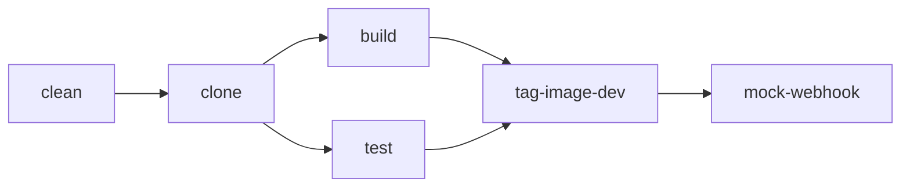
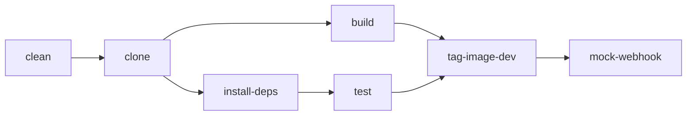
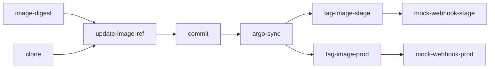

# Pipelines
## ci-quarkus

A CI pipeline for simple quarkus applications.
This pipeline is used by [greeting-api](https://github.com/tom-stockwell/greeting-api) application.

### Parameters

| Name                | Default  | Description                                                                             |
|---------------------|----------|-----------------------------------------------------------------------------------------|
| **app-name**        |          | Name of the application.                                                                |
| **git-url**         |          | URL of the git repository for the application source code.                              |
| **image-url**       |          | URL of the container image to publish.                                                  |
| **image-namespace** |          | Namespace of the container image url (i.e. quay.io/**<image-namespace>**/greeting-api). |
| git-revision        | `main`   | Revision to checkout for the git repository.                                            |
| image-tag           | `latest` | Tag of the image to publish.                                                            |
| env-dev             | `dev`    | Name/suffix for the development environment.                                            |
| mock-webhooks       | `true`   | Toggle whether webhooks are mocked.                                                     |

### Workspaces

| Name    | Description                                                                                                    |
|---------|----------------------------------------------------------------------------------------------------------------|
| source  | Holds the application source code.                                                                             |
| scratch | An ephemeral workspace used for tasks that require a workspace but do not need to share data from other tasks. |

### Tasks

| Name             | Task Name                           | Task Type   | Description                                                                                                                                                                                   |
|------------------|-------------------------------------|-------------|-----------------------------------------------------------------------------------------------------------------------------------------------------------------------------------------------|
| clean            | [script-185](/tasks#script-x)       | Task        | Deletes the `./target` directory from the *source* workspace.[^1]                                                                                                                             |
| clone            | git-clone                           | ClusterTask | Clones the git repository into the *source* workspace.                                                                                                                                        |
| test             | maven                               | ClusterTask | Runs `mvn verify` in the *source* workspace.                                                                                                                                                  |
| build            | buildah                             | ClusterTask | Builds a container image from `./Containerfile`.                                                                                                                                              |
| tag-image-dev    | skopeo-copy                         | ClusterTask | Tags the container image with the development environment tag. This should result in the [deploy](#deploy) being triggered.                                                                   |
| mock-webhook[^2] | [quay-webhook](/tasks#quay-webhook) | Task        | If the *mock-webhooks* parameter is set to `true`, this sends a mocked [Quay: Repository Push](https://docs.quay.io/guides/notifications.html#repository-push) webhook to the event listener. |

[^1]: Typically, this would be performed by the *clone* task, but due to permissions issues this task has been added as a workaround.
[^2]: This is only required as my local cluster is not internet facing, and therefore cannot be automatically triggered via webhooks from external sources.

## ci-react

A CI pipeline for simple react applications.
This pipeline is used by [greeting-ui](https://github.com/tom-stockwell/greeting-ui) application.
It is conceptually very similar to the [ci-quarkus](#ci-quarkus) pipeline.

### Parameters

| Name                | Default  | Description                                                                            |
|---------------------|----------|----------------------------------------------------------------------------------------|
| **app-name**        |          | Name of the application.                                                               |
| **git-url**         |          | URL of the git repository for the application source code.                             |
| **image-url**       |          | URL of the container image to publish.                                                 |
| **image-namespace** |          | Namespace of the container image url (i.e. quay.io/**<image-namespace>**/greeting-ui). |
| git-revision        | `main`   | Revision to checkout for the git repository.                                           |
| image-tag           | `latest` | Tag of the image to publish.                                                           |
| env-dev             | `dev`    | Name/suffix for the development environment.                                           |
| mock-webhooks       | `true`   | Toggle whether webhooks are mocked.                                                    |

### Workspaces

| Name    | Description                                                                                                    |
|---------|----------------------------------------------------------------------------------------------------------------|
| source  | Holds the application source code.                                                                             |
| scratch | An ephemeral workspace used for tasks that require a workspace but do not need to share data from other tasks. |

### Tasks

| Name             | Task Name                           | Task Type   | Description                                                                                                                                                                                   |
|------------------|-------------------------------------|-------------|-----------------------------------------------------------------------------------------------------------------------------------------------------------------------------------------------|
| clean            | [script-1001](/tasks#script-x)      | Task        | Deletes the `./node_modules` directory from the *source* workspace.[^1]                                                                                                                       |
| clone            | git-clone                           | ClusterTask | Clones the git repository into the *source* workspace.                                                                                                                                        |
| install-deps     | [npm](/tasks#npm)                   | Task        | Runs `npm ci` in the *source* workspace.                                                                                                                                                      |
| test             | [npm](/tasks#npm)                   | Task        | Runs `npm test` in the *source* workspace.                                                                                                                                                    |
| build            | buildah                             | ClusterTask | Builds a container image from `./Containerfile`.                                                                                                                                              |
| tag-image-dev    | skopeo-copy                         | ClusterTask | Tags the container image with the development environment tag. This should result in the [deploy](#deploy) pipeline being triggered.                                                          |
| mock-webhook[^2] | [quay-webhook](/tasks#quay-webhook) | Task        | If the *mock-webhooks* parameter is set to `true`, this sends a mocked [Quay: Repository Push](https://docs.quay.io/guides/notifications.html#repository-push) webhook to the event listener. |

## deploy

A pipeline which deploys a given image to a given environment/namespace using Argo CD.

### Parameters

| Name                  | Default          | Description                                                                            |
|-----------------------|------------------|----------------------------------------------------------------------------------------|
| **app-name**          |                  | Name of the application.                                                               |
| **git-url**           |                  | URL of the git repository for the application k8s resources source.                    |
| **image-url**         |                  | URL of the container image to deploy.                                                  |
| **image-namespace**   |                  | Namespace of the container image url (i.e. quay.io/**<image-namespace>**/greeting-ui). |
| image-tag             | `latest`         | Tag of the image to deploy.                                                            |
| environment           | `dev`            | Environment to deploy to.                                                              |
| mock-webhooks         | `false`          | Toggle whether webhooks are mocked.                                                    |
| git-branch            | `main`           | Branch of the git repository.                                                          |
| git-username          | `ci`             | Username of the git committer                                                          |
| git-email             | `ci@example.com` | Email of the git committer.                                                            |
| git-primary-message   | `Deploy to `     | Prefix for first line of the commit message. Environment name will be appended.        |
| git-secondary-message | `- image: `      | Prefix for second line of the commit message. Full image name will be appended.        |
| env-dev               | `dev`            | Name/suffix for the development environment.                                           |
| env-stage             | `stage`          | Name/suffix for the staging environment.                                               |
| env-prod              | `prod`           | Name/suffix for the prodution environment.                                             |

### Workspaces

| Name    | Description                                                                                                    |
|---------|----------------------------------------------------------------------------------------------------------------|
| source  | Holds the application k8s resources source.                                                                    |
| scratch | An ephemeral workspace used for tasks that require a workspace but do not need to share data from other tasks. |

### Tasks

| Name                   | Task Name                                                     | Task Type   | Description                                                                                                                                                                                   |
|------------------------|---------------------------------------------------------------|-------------|-----------------------------------------------------------------------------------------------------------------------------------------------------------------------------------------------|
| image-digest           | [image-digest](/tasks#image-digest)                           | Task        | Gets the image digest of the given image URL and tag combination.                                                                                                                             |
| clone                  | git-clone                                                     | ClusterTask | Clones the git repository into the *source* workspace.                                                                                                                                        |
| update-image-ref       | [kustomize](/tasks#kustomize)                                 | Task        | Updates the kustomize image reference for the given environment in the *source* workspace with the digest retrieved from the *image-digest* step.                                             |
| commit                 | git-cli                                                       | ClusterTask | Commits and pushes the repository updates in the *source* workspace to the given branch. Does nothing if there are no changes needed.                                                         |
| argo-sync              | [argocd-task-sync-and-wait](/tasks#argocd-task-sync-and-wait) | Task        | Initiates a sync for the relevant Argo CD application and waits for it to complete.                                                                                                           |
| tag-image-stage        | skopeo-copy                                                   | ClusterTask | Tags the container image with the staging environment tag. This should result in the [deploy](#deploy) pipeline being triggered again.                                                        |
| mock-webhook-stage[^2] | [quay-webhook](/tasks#quay-webhook)                           | Task        | If the *mock-webhooks* parameter is set to `true`, this sends a mocked [Quay: Repository Push](https://docs.quay.io/guides/notifications.html#repository-push) webhook to the event listener. |
| tag-image-prod         | skopeo-copy                                                   | ClusterTask | Tags the container image with the production environment tag.                                                                                                                                 |
| mock-webhook-prod[^2]  | [quay-webhook](/tasks#quay-webhook)                           | Task        | If the *mock-webhooks* parameter is set to `true`, this sends a mocked [Quay: Repository Push](https://docs.quay.io/guides/notifications.html#repository-push) webhook to the event listener. |

## To Do
- Make the pipelines more re-usable
  - Requires more details to be parameterised (e.g. Containerfile path)
- Investigate environment logic into custom webhook
- "Manual" approval of the deployment process, triggered via PR
