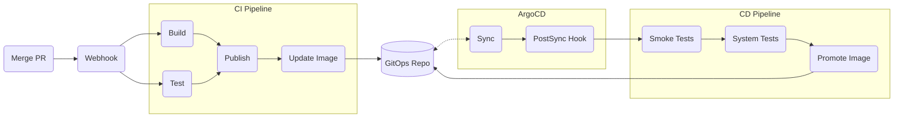

# Greeting Application CI/CD

## Components

- [`Pipelines`](./pipelines): contains pipelines
- [`Tasks`](./tasks): contains tasks & cluster tasks
- [`Triggers`](./triggers): contains various resources related to Tekton Triggers
- [`Workspace`](./workspace): contains various resources (e.g. PVCs, secrets, etc.) for the application workspace

## CI/CD Flow

The basic design for the CI/CD lifecycle of the individual components of the greeting application can be summarised as follows:

As can be seen, the CI & CD pipelines are implemented as separate pipelines.
This is a standard approach I recommend as it allows for flexibility in which technology is used for each type of pipeline, among other advantages.

The CI pipeline is triggered via a GitHub webhook and follows a fairly standard build & bake structure.
The application is tested and then built into a container image and pushed to a container registry.
The GitOps repository `dev` environment overlay is then updated with the newly built image reference.

The CD pipeline is triggered via an ArgoCD PostSync webhook that runs whenever a successful sync occurs in ArgoCD.
This will trigger the post deployment test to run, and then the next environment is updated in the same way.

See [pipelines](./pipelines) if you would like more thorough documentation of the individual pipelines and how they are implemented.

## To Do

- Refactor for [pet-battle](https://github.com/petbattle) application
- Cache application dependencies
- Handle HTTPS in webhooks route
- Find a better fix/workaround for different tasks in a pipeline running with different UIDs
- A demo application that shows the status of each component in each environment
    - i.e. it's current version & health. Maybe even pipeline statuses?
- Lint output
