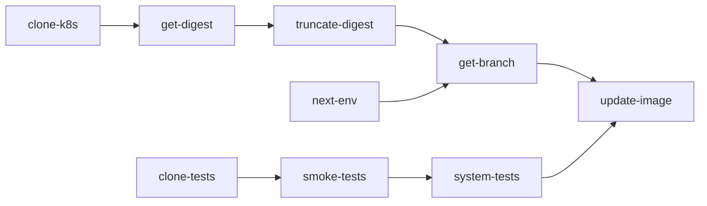
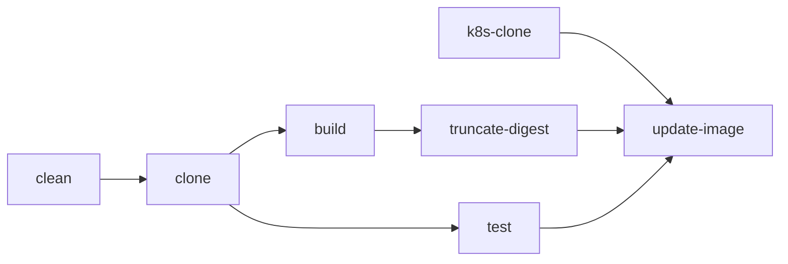
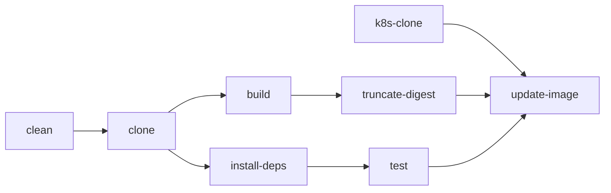

# Pipelines

## argo-postsync

An ArgoCD postsync pipeline for simple applications.

This pipeline should be triggered by a postsync ArgoCD hook.

The pipeline will test the application that was just deployed, before updating the next environment in the pipeline with the successfully tested image.
In the case of a production change, a PR will be created instead of the changes being merged automatically.

### Tasks

| Name             | Description                                                                                                        |
|------------------|--------------------------------------------------------------------------------------------------------------------|
| clone-tests[^1]  | Clones the test repository.                                                                                        |
| smoke-tests[^1]  | TODO: Runs smoke tests from the test repository.                                                                   |
| system-tests[^1] | TODO: Runs system/integration tests from the test repository. Skipped in production.                               |
| clone-k8s        | Clones the kustomization repository.                                                                               |
| get-digest       | Extracts the digest of the application image used in the current environment.                                      |
| truncate-digest  | Gets a truncated version of the digest hash.                                                                       |
| next-env         | Determines the next environment to update.                                                                         |
| get-branch       | Determines the git branch to push kustomization changes to.                                                        |
| update-image     | Updates the image in the environment overlay determined by `next-env` with the image digest found in `get-digest`. |

[^1]: These tasks have yet to be implemented and are currently placeholders.

### Parameters

| Name                     | Type   | Default                         | Description                                                             |
| ------------------------ | ------ | ------------------------------- | ----------------------------------------------------------------------- |
| image-url                | string |                                 | URL of the container image to promote. Should not have a tag or digest. |
| git-url                  | string |                                 | URL of the git repository containing kustomize manifests to update.     |
| git-repo-full-name       | string |                                 | The full repository name (e.g. `tektoncd/catalog`).                     |
| git-branch-default       | string | `main`                          | Default branch of the git repository.                                   |
| overlays-path            | string | `overlays`                      | Path to the directory containing the environment overlays.              |
| environment              | string |                                 | The environment that was just synced.                                   |
| environments             | array  | `["dev","stage","prod"]`        | The sequential list of environments to deploy to.                       |
| github-token-secret-name | string | `github-demo-gitops-cicd-token` | Name of the Secret that contains the GitHub token for PR creation.      |

### Workspaces

| Name   | Optional | Read-Only | Description                                                       |
| ------ | -------- | --------- | ----------------------------------------------------------------- |
| source | false    | false     | A workspace to hold the kustomize repository for the application. |

## ci-quarkus

A CI pipeline for simple quarkus applications.

This pipeline will test the quarkus application before building & publishing a container image.
A kustomize overlay from the given repository will then be updated with the new image details.

### Tasks
  

| Name            | Description                                                                               |
|-----------------|-------------------------------------------------------------------------------------------|
| clean           | Cleans the source workspace.[^2]                                                          |
| clone           | Clones the application source repository into the `source` workspace.                     |
| test            | Runs unit tests.                                                                          |
| build           | Builds & publishes a container image for the application.                                 |
| truncate-digest | Gets a truncated version of the digest hash from the result of `build`.                   |
| k8s-clone       | Clones the kustomization repository for the application.                                  |
| get-branch      | Determines the git branch to push kustomization changes to.                               |
| update-image    | Updates the image in the dev environment overlay image digest from the result of `build`. |

[^2]: Only required due to a bug in my setup that I need to look further into. The `clone` task runs with a different UID than other tasks and therefore can't delete the files created by those tasks.

### Parameters

| Name           | Type   | Default           | Description                                                                |
| -------------- | ------ | ----------------- | -------------------------------------------------------------------------- |
| git-url        | string |                   | URL of the git repository containing application source code.              |
| git-revision   | string | `main`            | Git revision to checkout for `git-url`.                                    |
| image-url      | string |                   | URL of the container image to publish. Should not include a tag or digest. |
| image-tag      | string | `latest`          | Tag of the container image to publish.                                     |
| dockerfile     | string | `./Containerfile` | Path to the Dockerfile to build.                                           |
| k8s-git-url    | string |                   | URL of the git repository containing k8s manifests.                        |
| k8s-git-branch | string | `main`            | Git revision to checkout for `k8s-git-url`                                 |
| overlay-path   | string | `overlays/dev`    | Path to the Kustomize overlay to update.                                   |

### Workspaces

| Name       | Optional | Read-Only | Description                                                                            |
| ---------- | -------- | --------- | -------------------------------------------------------------------------------------- |
| source     | false    | false     | A workspace to hold the application source code repository.                            |
| k8s-source | false    | false     | A workspace to hold the kustomize repository for the application.                      |
| scratch    | false    | false     | A throwaway workspace used for tasks that require a workspace that should be optional. |

## ci-react

A CI pipeline for simple React applications.

This pipeline will test the React application before building & publishing a container image.
A kustomize overlay from the given repository will then be updated with the new image details.

### Tasks

| Name            | Description                                                                               |
|-----------------|-------------------------------------------------------------------------------------------|
| clean           | Cleans the source workspace.[^2]                                                          |
| clone           | Clones the application source repository into the `source` workspace.                     |
| install-deps    | Install application dependencies via `npm install`.                                       |
| test            | Runs unit tests.                                                                          |
| build           | Builds & publishes a container image for the application.                                 |
| truncate-digest | Gets a truncated version of the digest hash from the result of `build`.                   |
| k8s-clone       | Clones the kustomization repository for the application.                                  |
| get-branch      | Determines the git branch to push kustomization changes to.                               |
| update-image    | Updates the image in the dev environment overlay image digest from the result of `build`. |
